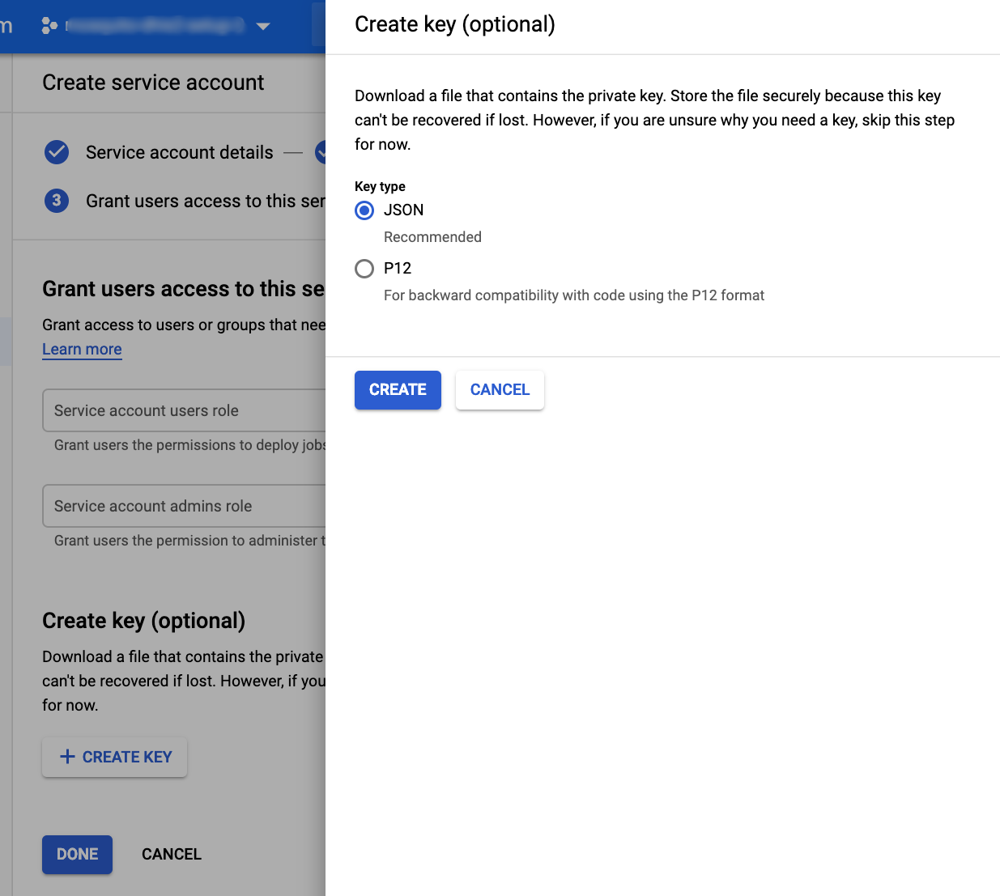
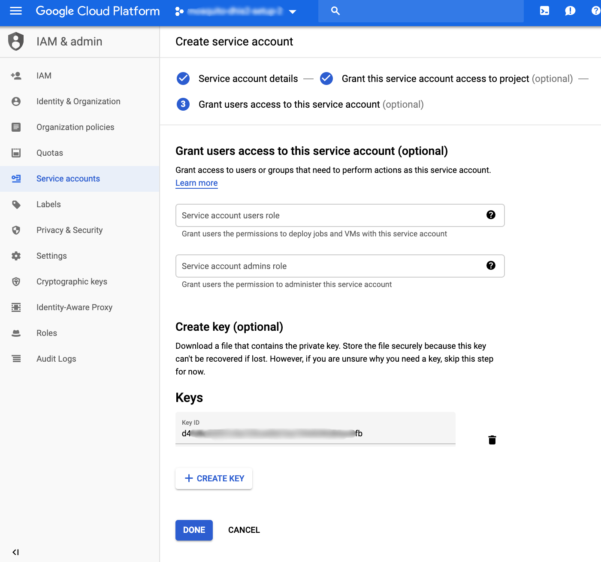

TODO: Document signing up for Google Cloud Platform

TODO: Document creating a project

# Create a service account

TODO: Improve documentation






# Install service key

Copy the contents of the downloaded service key JSON file into `dhis-google-auth.json`

```shell
sudo -u dhis nano /home/dhis/config/dhis-google-auth.json
sudo -u dhis chmod 0600 /home/dhis/config/dhis-google-auth.json
sudo -u dhis /home/dhis/tomcat-dhis/bin/shutdown.sh
sudo -u dhis /home/dhis/tomcat-dhis/bin/startup.sh
```

```console
vagrant@vagrant:~$ sudo -u dhis nano /home/dhis/config/dhis-google-auth.json
Unable to create directory /home/vagrant/.local/share/nano/: No such file or directory
It is required for saving/loading search history or cursor positions.

Press Enter to continue

vagrant@vagrant:~$ sudo -u dhis chmod 0600 /home/dhis/config/dhis-google-auth.json
vagrant@vagrant:~$ sudo -u dhis /home/dhis/tomcat-dhis/bin/shutdown.sh
Using CATALINA_BASE:   /home/dhis/tomcat-dhis
Using CATALINA_HOME:   /usr/share/tomcat8
Using CATALINA_TMPDIR: /home/dhis/tomcat-dhis/temp
Using JRE_HOME:        /usr/lib/jvm/java-8-openjdk-amd64/
Using CLASSPATH:       /usr/share/tomcat8/bin/bootstrap.jar:/usr/share/tomcat8/bin/tomcat-juli.jar
Mar 21, 2019 1:23:53 AM org.apache.catalina.startup.ClassLoaderFactory validateFile
WARNING: Problem with directory [/home/dhis/tomcat-dhis/common/classes], exists: [false], isDirectory: [false], canRead: [false]
Mar 21, 2019 1:23:54 AM org.apache.catalina.startup.ClassLoaderFactory validateFile
WARNING: Problem with directory [/home/dhis/tomcat-dhis/common], exists: [false], isDirectory: [false], canRead: [false]
Mar 21, 2019 1:23:54 AM org.apache.catalina.startup.ClassLoaderFactory validateFile
WARNING: Problem with directory [/usr/share/tomcat8/common/classes], exists: [false], isDirectory: [false], canRead: [false]
Mar 21, 2019 1:23:54 AM org.apache.catalina.startup.ClassLoaderFactory validateFile
WARNING: Problem with directory [/usr/share/tomcat8/common], exists: [false], isDirectory: [false], canRead: [false]
Mar 21, 2019 1:23:54 AM org.apache.catalina.startup.ClassLoaderFactory validateFile
WARNING: Problem with directory [/home/dhis/tomcat-dhis/server/classes], exists: [false], isDirectory: [false], canRead: [false]
Mar 21, 2019 1:23:54 AM org.apache.catalina.startup.ClassLoaderFactory validateFile
WARNING: Problem with directory [/home/dhis/tomcat-dhis/server], exists: [false], isDirectory: [false], canRead: [false]
Mar 21, 2019 1:23:54 AM org.apache.catalina.startup.ClassLoaderFactory validateFile
WARNING: Problem with directory [/usr/share/tomcat8/server/classes], exists: [false], isDirectory: [false], canRead: [false]
Mar 21, 2019 1:23:54 AM org.apache.catalina.startup.ClassLoaderFactory validateFile
WARNING: Problem with directory [/usr/share/tomcat8/server], exists: [false], isDirectory: [false], canRead: [false]
Mar 21, 2019 1:23:54 AM org.apache.catalina.startup.ClassLoaderFactory validateFile
WARNING: Problem with directory [/home/dhis/tomcat-dhis/shared/classes], exists: [false], isDirectory: [false], canRead: [false]
Mar 21, 2019 1:23:54 AM org.apache.catalina.startup.ClassLoaderFactory validateFile
WARNING: Problem with directory [/home/dhis/tomcat-dhis/shared], exists: [false], isDirectory: [false], canRead: [false]
Mar 21, 2019 1:23:54 AM org.apache.catalina.startup.ClassLoaderFactory validateFile
WARNING: Problem with directory [/usr/share/tomcat8/shared/classes], exists: [false], isDirectory: [false], canRead: [false]
Mar 21, 2019 1:23:54 AM org.apache.catalina.startup.ClassLoaderFactory validateFile
WARNING: Problem with directory [/usr/share/tomcat8/shared], exists: [false], isDirectory: [false], canRead: [false]
Mar 21, 2019 1:23:55 AM org.apache.catalina.startup.Catalina stopServer
SEVERE: Could not contact [localhost:[8005]]. Tomcat may not be running.
Mar 21, 2019 1:23:55 AM org.apache.catalina.startup.Catalina stopServer
SEVERE: Catalina.stop:
java.net.ConnectException: Connection refused (Connection refused)
        at java.net.PlainSocketImpl.socketConnect(Native Method)
        at java.net.AbstractPlainSocketImpl.doConnect(AbstractPlainSocketImpl.java:350)
        at java.net.AbstractPlainSocketImpl.connectToAddress(AbstractPlainSocketImpl.java:206)
        at java.net.AbstractPlainSocketImpl.connect(AbstractPlainSocketImpl.java:188)
        at java.net.SocksSocketImpl.connect(SocksSocketImpl.java:392)
        at java.net.Socket.connect(Socket.java:589)
        at java.net.Socket.connect(Socket.java:538)
        at java.net.Socket.<init>(Socket.java:434)
        at java.net.Socket.<init>(Socket.java:211)
        at org.apache.catalina.startup.Catalina.stopServer(Catalina.java:497)
        at sun.reflect.NativeMethodAccessorImpl.invoke0(Native Method)
        at sun.reflect.NativeMethodAccessorImpl.invoke(NativeMethodAccessorImpl.java:62)
        at sun.reflect.DelegatingMethodAccessorImpl.invoke(DelegatingMethodAccessorImpl.java:43)
        at java.lang.reflect.Method.invoke(Method.java:498)
        at org.apache.catalina.startup.Bootstrap.stopServer(Bootstrap.java:406)
        at org.apache.catalina.startup.Bootstrap.main(Bootstrap.java:495)

Tomcat stopped
vagrant@vagrant:~$ sudo -u dhis /home/dhis/tomcat-dhis/bin/startup.sh
Using CATALINA_BASE:   /home/dhis/tomcat-dhis
Using CATALINA_HOME:   /usr/share/tomcat8
Using CATALINA_TMPDIR: /home/dhis/tomcat-dhis/temp
Using JRE_HOME:        /usr/lib/jvm/java-8-openjdk-amd64/
Using CLASSPATH:       /usr/share/tomcat8/bin/bootstrap.jar:/usr/share/tomcat8/bin/tomcat-juli.jar
Tomcat started.
Tomcat started
```
